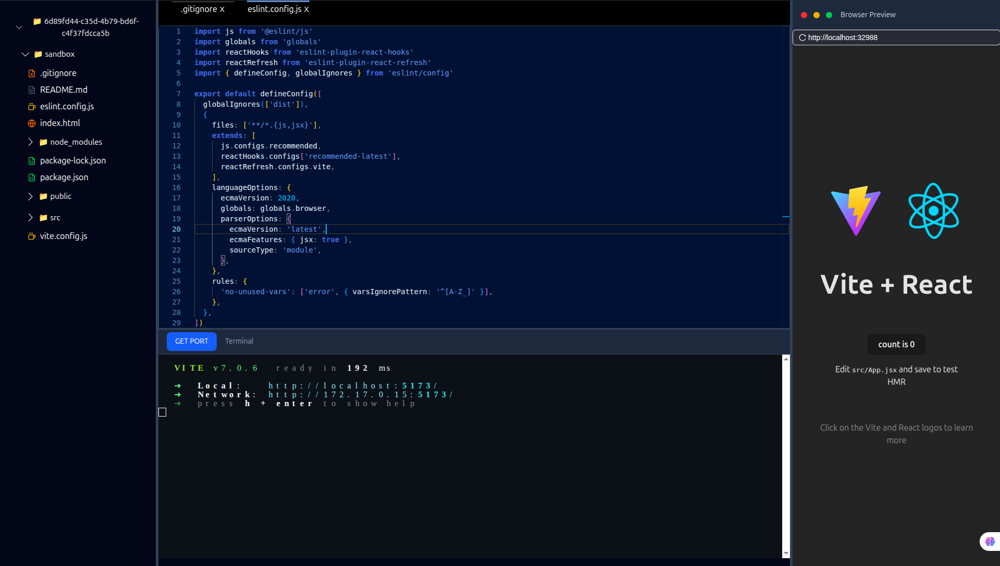

# ProjectsIDX 🚀  
**Cloud IDE | Node.js, React, Socket.IO, Docker**

ProjectsIDX is a full-stack collaborative **web IDE** designed to simplify web development workflows. It provides a real-time coding environment with project creation, editing, and execution inside **Docker containers**, supporting **React** and **Next.js** projects for now.

---

## ✨ Features
- 🖥️ **Full-stack IDE** with support for React and Next.js projects  
- ⚡ **Real-time code synchronization** for 20+ simultaneous users using **WebSockets**  
- 📝 Integrated **Monaco Editor** with syntax highlighting & IntelliSense  
- 💻 Interactive **Xterm.js terminal** inside the browser  
- 📦 **Docker containerization** for isolated project environments  
- 🔗 **Frontend-Backend integration** with live project execution  
- 🔐 User authentication system with signup & login  
- 📂 Project tree view and file explorer  

---

## 🛠️ Tech Stack
- **Frontend:** React.js, Vite, Zustand, TailwindCSS, Ant Design, Socket.IO, Websocket
- **Backend:** Node.js, Express.js, MongoDB, Bull (queues), AWS SDK, Razorpay (planned for monetization)  
- **DevOps & Infra:** Docker, Bull Board, Redis , Socket.IO, Websocket  
- **Others:** Monaco Editor, Xterm.js  

---

## Image



## 📂 Project Structure
```bash
.
├── frontend     # React + Vite frontend (UI, Monaco, Socket connections)
├── projectService      # Core backend for project handling & container creation
├── userService     # Extended backend (auth, queues, DB, mail service)

---


